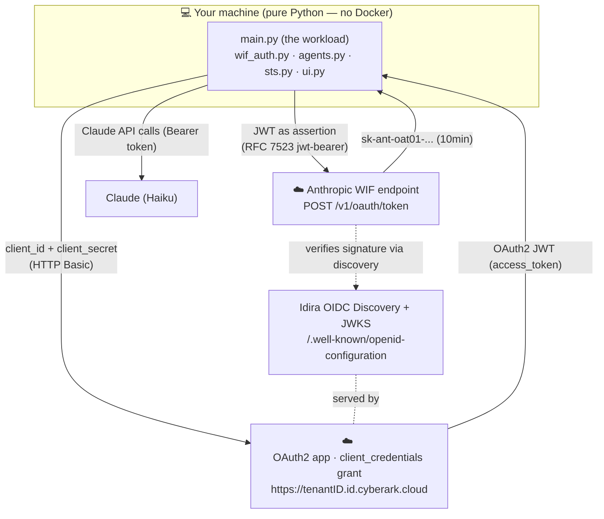
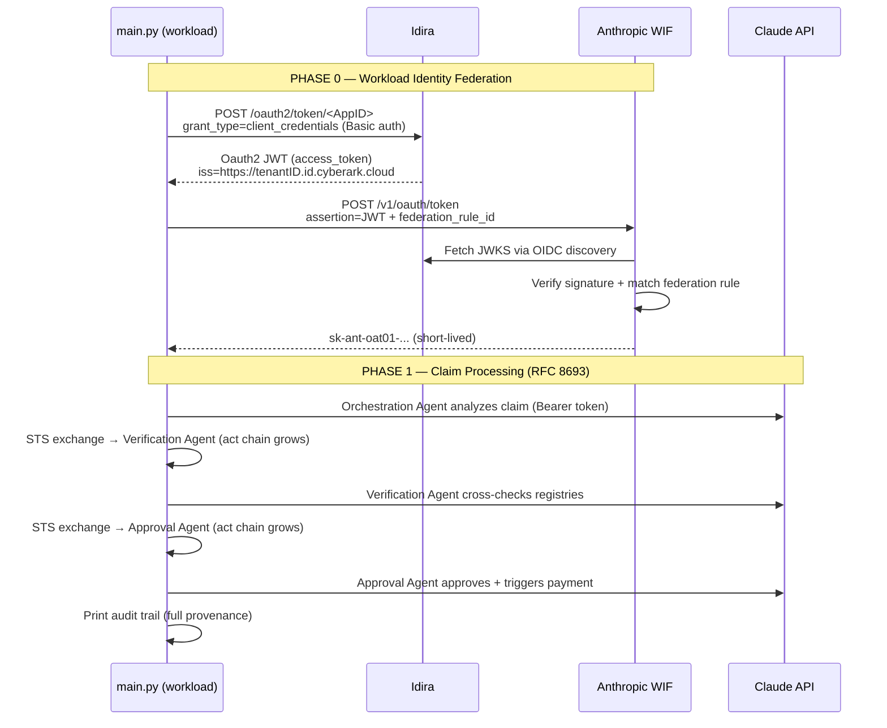

# Agentic AI Identity Security — v1
## Workload Identity Federation with Idira

The workload authenticates to Anthropic using **Idira** as the OIDC provider. No `sk-ant-...` API key is stored anywhere. Every token is short-lived and cryptographically bound to the workload's identity.

> **Note on scope.** v1 is a **pure-Python** application — there is **no Docker and no SPIRE** here. SPIRE Server / SPIRE Agent / Docker attestation belong to **v2**. In v1 the workload proves its identity with an OAuth2 **client credentials** grant against Idira. If you're looking for the SPIFFE/SPIRE version, see `agentic-identity-demo-spiffe/`. A side-by-side comparison is in [Section 11](#11-v1-vs-v2).

---

## Table of Contents

1. [The Big Idea](#1-the-big-idea)
2. [Concepts in Plain Language](#2-concepts-in-plain-language)
3. [Architecture](#3-architecture)
4. [How the Pieces Interact (Sequence)](#4-how-the-pieces-interact-sequence)
5. [Code Base Walkthrough](#5-code-base-walkthrough)
6. [Prerequisites & Installation](#6-prerequisites--installation)
7. [Step-by-Step: Idira Setup](#7-step-by-step-idira-setup)
8. [Step-by-Step: Anthropic Console Setup](#8-step-by-step-anthropic-console-setup)
9. [Run the Demo](#9-run-the-demo)
10. [What You See When It Runs](#10-what-you-see-when-it-runs)
11. [Troubleshooting Reference](#13-troubleshooting-reference)
12. [Security Notes](#14-security-notes)

---

## 1. The Big Idea

A government portal receives a **housing benefit claim**. Three AI agents process it end-to-end — **no human caseworker reviews the decision**:

| Agent | Role |
|-------|------|
| **Orchestration Agent** | Receives the claim, decides what must be verified |
| **Verification Agent** | Cross-checks national ID, tax-authority income, municipal residency |
| **Approval Agent** | Reviews the verdict, approves the claim, triggers payment |

Because no human is in the loop, **identity and accountability must be cryptographic and complete** at every step. v1 demonstrates two complementary identity layers:

| Layer | Question it answers | Mechanism |
|-------|--------------------|-----------|
| **Workload Identity** | "Is this workload allowed to call Anthropic?" | Idira OIDC JWT → Anthropic WIF (RFC 7523) |
| **Delegation Identity** | "Which agent delegated to which, on whose behalf?" | RFC 8693 token exchange + nested `act` chain |

The headline of v1: **no static `sk-ant-...` API key.** Instead of embedding a permanent secret, the workload exchanges a short-lived JWT (minted by Idira) for a short-lived Anthropic access token that expires in an hour.

---

## 2. Concepts in Plain Language

### Idira — the OIDC provider
**Idira** is the identity provider in this demo at `https://tenantID.id.cyberark.cloud`). It hosts an **OAuth2 application** configured for the **client credentials** grant. The workload sends its `client_id` + `client_secret`, and Idira returns a signed **OAuth2 JWT** (`access_token`) describing the workload.

> Think of Idira as the *passport office* and the JWT as a *passport* with an expiry date — issued to the workload after it proves itself with credentials.

### OAuth2 client credentials grant
A machine-to-machine flow: no human, no browser. The app authenticates with its client ID/secret (HTTP Basic auth, per RFC 6749 §2.3.1) and gets back a token. This is the credential v2 later replaces with SPIFFE.

### Anthropic Workload Identity Federation (WIF)
Instead of a static API key, your workload presents an **external JWT** (here, Idira's `access_token`). Anthropic:
1. Validates the JWT signature against a **federation issuer** you register (Idira's public keys, fetched via OIDC discovery).
2. Matches the JWT against a **federation rule** (which `sub`/issuer may act as which service account).
3. Returns a **short-lived access token** (`sk-ant-oat01-...`).

Key building blocks you configure in the Anthropic Console:
- **Service account** (`svac_...`) — the non-human identity the token acts as.
- **Federation issuer** (`fdis_...`) — registers Idira as a trusted OIDC provider.
- **Federation rule** (`fdrl_...`) — "JWTs from Idira with subject X may act as service account Z."

I added the screenhots in the folder : screenhots/anthropic.

### RFC 7523 — the JWT-bearer exchange
The protocol used to swap the Idira JWT for an Anthropic token: `grant_type = urn:ietf:params:oauth:grant-type:jwt-bearer`, with the Idira JWT in the `assertion` field. (v2 uses the *exact same* exchange — only the source of the JWT changes.)

### RFC 8693 + the `act` chain
Each agent-to-agent hop goes through a Security Token Service (STS) that mints a new, audience-locked, 5-minute JWT. The `act` claim nests the full delegation history, so the final token proves: *citizen → orchestration → verification → approval*.

---

## 3. Architecture

> v1 has **no SPIRE Server and no SPIRE Agent** — that infrastructure is v2-only. The three actors in v1 are: **the app**, **Idira** (OIDC provider), and **Anthropic WIF**.

### Component diagram



### Full identity chain

```
Idira
   │  client credentials grant
   ▼
OIDC JWT   sub: <client-id / app subject>
   │        iss: https://tenantID.id.cyberark.cloud
   │  presented to Anthropic (RFC 7523 jwt-bearer)
   ▼
Anthropic WIF token  (sk-ant-oat01-..., 10 min)
   │  authenticates all Claude calls
   ▼
Orchestration Agent ──[STS exchange, RFC 8693]──▶ Verification Agent
                                                        │
                                  [STS exchange, RFC 8693]
                                                        ▼
                                                 Approval Agent
   │
   ▼
Audit trail: Idira → Workload → Citizen → Agent → Agent  (all cryptographic)
```

---

## 4. How the Pieces Interact (Sequence)



---

## 5. Code Base Walkthrough

```
agentic-identity-demo-Oauth/
├── requirements.txt        # Python deps (anthropic, requests, PyJWT, rich, python-dotenv)
├── .env.example            # Config template → copy to .env
│
├── main.py                 # Demo orchestration (Phase 0 WIF + Phase 1 agents)
├── wif_auth.py             # Idira client-credentials → JWT → Anthropic RFC 7523 exchange
├── agents.py               # The 3 Claude agents (Orchestration/Verification/Approval)
├── sts.py                  # RFC 8693 Security Token Service + act chain
└── ui.py                   # Rich terminal rendering
```

### Key files explained

| File | What it does | Why it matters |
|------|-------------|----------------|
| **`wif_auth.py`** | `Config.from_env()` loads settings; `WIFAuthenticator.get_idira_jwt()` runs the client-credentials grant against Idira; `exchange_for_anthropic_token()` performs the RFC 7523 swap | turns Idira credentials into a short-lived Anthropic token, no API key |
| **`agents.py`** | Three thin Claude wrappers (`OrchestrationAgent`, `VerificationAgent`, `ApprovalAgent`), each with a role-specific system prompt | Uses `Anthropic(auth_token=...)` — **Bearer token, not `x-api-key`** |
| **`sts.py`** | `SecurityTokenService`: mints the root token, performs RFC 8693 exchanges, nests the `act` chain, enforces the `REGISTRY` policy (which agent may call which) | The delegation/accountability story. |
| **`main.py`** | Two phases: Phase 0 (WIF auth, every claim shown) and Phase 1 (the three-agent claim flow), with the audit trail and final JWT | The narrative the audience watches |
| **`ui.py`** | Rich panels, tables, and JSON syntax highlighting | Makes the token flow legible for live demo |

### How `wif_auth.py` works (the two steps)

```
Step 1 — get_idira_jwt()
  POST {tenant}/oauth2/token/{app_id}
    grant_type=client_credentials, scope=openid
    Authorization: Basic base64(client_id:client_secret)
  → response.access_token  ← the JWT

Step 2 — exchange_for_anthropic_token(jwt)
  POST https://api.anthropic.com/v1/oauth/token
    grant_type = urn:ietf:params:oauth:grant-type:jwt-bearer
    assertion  = <the Idira JWT>
    federation_rule_id, organization_id, service_account_id, workspace_id
  → sk-ant-oat01-...  (short-lived Anthropic access token)
```

---

## 6. Prerequisites & Installation

> v1 is pure Python. **You do not need Docker.** (Docker only appears in v2 (spiffe).)

### 6.1 Install Python 3.11+

**macOS** (with Homebrew):
```bash
brew install python@3.11
python3 --version    # should print 3.11.x or newer
```

If you don't have Homebrew, download Python from <https://www.python.org/downloads/macos/>.

### 6.2 Accounts you need
- Admin access to your **Idira** tenant: `https://tenantID.id.cyberark.cloud`
- Admin access to the **Anthropic Console**: <https://console.anthropic.com>

---

## 7. Step-by-Step: Idira Setup

Log in to your Idira tenant as an admin.

### 7.1 Create an Oauth2 service account

1. Navigate to **Manage space → Inventory → Identities → Users**
2. Click **Add User**
3. Create a service user and check the box **Is OAuth confidential client**


### 7.2 Create an OAuth2 Application

1. Navigate to **Apps & Widgets → OAuth2 Client**
2. Click **Add OAuth2 Client**
3. Fill in:

| Field | Value |
|-------|-------|
| **Application ID** | e.g. `anthropic_wif01` → goes in `IDIRA_APP_ID` |
| **Name** | Anthropic WIF Demo |
| **General Usage** | `choose confidential and check Must be Oauth Client` |
| **Tokens Type** | `choose JWTRS256 and check Client Creds` |
| **Token Lifetime** | `1 hour` (or less) |

4. Under **Permissions** → Add the service account created in step 7.1

### 7.3 Find the exact `iss` and `sub` (critical)

The federation issuer you register in Anthropic must match the **exact** `iss` claim in Idira's JWTs, and the federation rule's subject must match the JWT's `sub`. Decode a real token to read them:

```bash
# Get a token from Idira
curl -s -X POST "https://tenantID.id.cyberark.cloud/oauth2/token/YOUR_APP_ID" \
  -H "Content-Type: application/x-www-form-urlencoded" \
  -u "YOUR_CLIENT_ID:YOUR_CLIENT_SECRET" \
  -d "grant_type=client_credentials&scope=openid"

# Decode the access_token's claims
python3 -c "
import jwt, sys
claims = jwt.decode(sys.argv[1], options={'verify_signature': False})
print('iss:', claims.get('iss'))
print('sub:', claims.get('sub'))
print('aud:', claims.get('aud'))
" YOUR_ACCESS_TOKEN_HERE
```

- The `iss` value (e.g. `https://tenantID.id.cyberark.cloud`) → the **Issuer URL** in Anthropic.
- The `sub` value (typically your **Client ID**) → the **Subject prefix** in the federation rule. Use the **exact** value for a single app (no wildcard).

### 7.3 Verify Oauth2 discovery

Anthropic fetches Idira's public keys via discovery. Confirm it's reachable:

```bash
curl https://tenantID.id.cyberark.cloud/.well-known/openid-configuration | python3 -m json.tool
```

You should see `issuer`, `token_endpoint`, and `jwks_uri`.

---

## 8. Step-by-Step: Anthropic Console Setup

Log in to <https://console.anthropic.com>.

### 8.1 Create a service account
**Settings → Service accounts → Create service account.** Name it (e.g. `agentic-demo-workload`). Copy the `svac_...` → `ANTHROPIC_SERVICE_ACCOUNT_ID`.

### 8.2 Add the service account to a workspace
**Settings → Workspaces → [your workspace] → Members.** Add the service account. Copy the `wrkspc_...` → `ANTHROPIC_WORKSPACE_ID`.

### 8.3 Register the federation issuer
**Settings → Workload identity → Issuers → Create issuer.**

| Field | Value |
|-------|-------|
| **Name** | `idira` |
| **Issuer URL** | The exact `iss` from Step 7.3 (e.g. `https://tenantID.id.cyberark.cloud/`) |
| **JWKS source** | `discovery` (Idira serves `.well-known/openid-configuration`) |

### 8.4 Create the federation rule
**Settings → Workload identity → Federation rules → Create rule.**

| Field | Value |
|-------|-------|
| **Issuer** | `idira` |
| **Match — Subject prefix** | The `sub` from Step 7.3 |
| **Match — Audience** *(optional)* | the `aud` from the JWT |
| **Target service account** | the `svac_...` from 8.1 |
| **Scope** | `workspace:developer` |
| **Token lifetime** | `3600` |

Copy the `fdrl_...` → `ANTHROPIC_FEDERATION_RULE_ID`.

### 8.5 Find your organization ID
**Settings → Organization** → copy the UUID → `ANTHROPIC_ORGANIZATION_ID`.

---

## 9. Run the Demo

### 9.1 Set up the Python environment

```bash
cd agentic-identity-demo-Oauth

# Create and activate a virtual environment
python3 -m venv .venv
source .venv/bin/activate          # macOS/Linux
# .venv\Scripts\activate           # Windows PowerShell

# Install dependencies
pip3 install -r requirements.txt
```

### 9.2 Configure `.env`

```bash
cp .env.example .env
```

Fill in:

```bash
# Idira
IDIRA_TENANT_URL=https://tenantID.id.cyberark.cloud
IDIRA_APP_ID=anthropic-wif-demo        # your App ID from 7.1
IDIRA_CLIENT_ID=<your-svc-account-Oauth2-step7.1>
IDIRA_CLIENT_SECRET=<your-client-secret(password of the svc account step7.1)>
IDIRA_SCOPE=openid

# Anthropic WIF
ANTHROPIC_ORGANIZATION_ID=<uuid>
ANTHROPIC_SERVICE_ACCOUNT_ID=svac_...
ANTHROPIC_FEDERATION_RULE_ID=fdrl_...
ANTHROPIC_WORKSPACE_ID=wrkspc_...
```

### 9.3 Run

```bash
python3 main.py
```

The demo has two phases, paced by pressing **Enter**:

- **Phase 0 — WIF Authentication:** the workload gets its Idira JWT and exchanges it for an Anthropic token. Every claim is printed.
- **Phase 1 — Claim Processing:** the three agents resolve the claim; each hop goes through the STS (RFC 8693). The full actor chain is visible in every JWT.

---

## 10. What You See When It Runs

**Phase 0 — WIF authentication**

```
● WIF Step 1  Workload → Idira (client credentials grant)
  ✓ IDIRA JWT received  sub: <client-id>  iss: https://tenantID.id.cyberark.cloud

● WIF Step 2  IDIRA JWT → Anthropic (RFC 7523 jwt-bearer grant)
  ✓ Anthropic access token minted  type: Bearer  expires_in: 3600s
    Token (masked): sk-ant-oat01-...[redacted]
```

**Phase 1 — claim processing**

```
● Step 0  Citizen submits claim → STS mints root token
● Step 1  Orchestration Agent — receives claim, delegates verification
   🔐 STS Exchange: Orchestration-Agent → Verification-Agent
● Step 2  Verification Agent — cross-checks national ID, income, residency
   🔐 STS Exchange: Verification-Agent → Approval-Agent
● Step 3  Approval Agent — reviews verdict, approves claim, triggers payment

✅ Audit Trail — Full Provenance (WIF + RFC 8693) — No caseworker involved
```

---

## 11. Troubleshooting Reference

| Symptom | Likely cause | Fix |
|---------|-------------|-----|
| `IDIRA token request failed (401)` | Wrong client ID/secret, or app App ID in the URL | Verify creds; confirm the App ID path `/oauth2/token/<AppID>` |
| `IDIRA response contains no JWT` | App not configured for `openid` / JWT token type | Enable `openid` scope and JWT token type in the Idira app |
| `Anthropic WIF exchange failed (401)` | `iss` mismatch, `sub` mismatch, or service account not in workspace | Decode the JWT (7.2); align issuer URL + rule subject; add svac to workspace |
| `Configuration Error: missing variables` | `.env` incomplete | Fill every required var (see 9.2) |

Quick credential check:
```bash
# Confirm Idira returns a decodable JWT
curl -s -X POST "https://tenantID.id.cyberark.cloud/oauth2/token/YOUR_APP_ID" \
  -u "YOUR_CLIENT_ID:YOUR_CLIENT_SECRET" \
  -d "grant_type=client_credentials&scope=openid" | python3 -m json.tool
```

---

## 12. Security Notes

This is a **demo**. For production:

| Demo choice | Production guidance |
|-------------|--------------------|
| Client secret in `.env` | Store in a secrets manager (IDIRA, Vault, cloud KMS); rotate regularly — **or move to v2 (SPIFFE) to eliminate the secret entirely** |
| STS uses a shared HMAC secret + plain agent-name string | Each agent should present its own verifiable identity (mTLS/SPIFFE) validated before the RFC 8693 exchange (this is the "simplification note" shown in the demo) |
| Single demo service account | Scope service accounts narrowly per workload/environment |
| Long-ish token lifetimes | Use the shortest viable `token_lifetime_seconds` |

> **The core win of v1:** no static `sk-ant-...` API key. The workload's Anthropic credential is minted on demand and expires in an hour. v2 takes the next step and removes the client secret too.

---

*Built by Elmehdi Aabad — Identity Security. Part of the [My IAM thoughts about Agentic AI](https://sme-access.com/?p=233) series (v1 → v2).*

**Further reading:** [Anthropic WIF](https://platform.claude.com/docs/en/manage-claude/workload-identity-federation) · [RFC 7523](https://www.rfc-editor.org/rfc/rfc7523) · [RFC 8693](https://datatracker.ietf.org/doc/html/rfc8693) · [Idira](https://docs.cyberark.com/identity)
